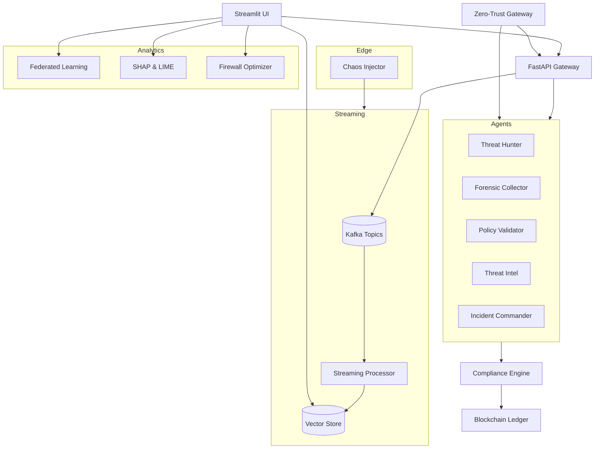

# Architecture Overview

```mermaid
graph TD
    subgraph Edge
        Chaos[Chaos Injector]
    end
    subgraph Streaming
        Kafka[(Kafka Topics)] --> Flink[Streaming Processor]
        Flink --> VectorDB[(Vector Store)]
    end
    subgraph Agents
        Hunter[Threat Hunter]
        Forensic[Forensic Collector]
        Policy[Policy Validator]
        Intel[Threat Intel]
        Commander[Incident Commander]
    end
    subgraph Analytics
        Federated[Federated Learning]
        XAI[SHAP & LIME]
        RL[Firewall Optimizer]
    end
    Streamlit[Streamlit UI] --> FastAPI[FastAPI Gateway]
    FastAPI --> Kafka
    FastAPI --> Agents
    Agents --> Compliance[Compliance Engine]
    Compliance --> Ledger[Blockchain Ledger]
    Streamlit --> VectorDB
    Streamlit --> XAI
    Streamlit --> Federated
    Streamlit --> RL
    ZeroTrust[Zero-Trust Gateway] --> FastAPI
    ZeroTrust --> Agents
    Chaos --> Streaming
```

The platform stitches together agentic orchestration, streaming analytics, zero-trust enforcement, and privacy-preserving AI in a single interactive demo.
